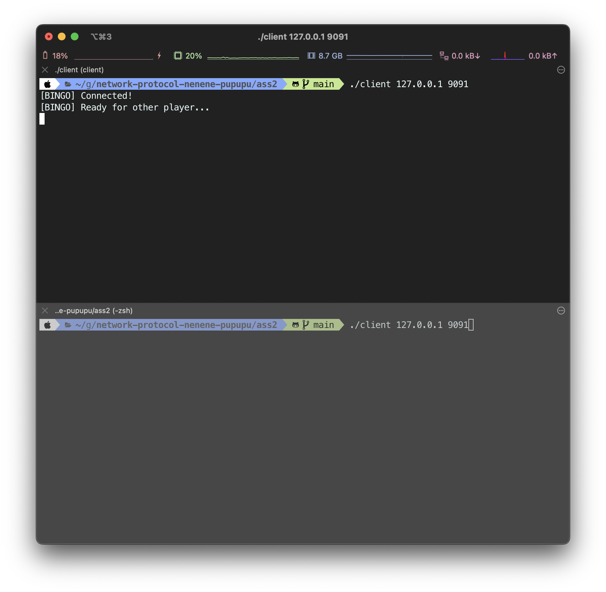

# Assignment#2 Bingo

## 조원

2021081703 문종환

2021092379 성준모

2020015050 이소을

## 코드

### Github

[https://github.com/nenene-pupupu/socket-bingo](https://github.com/nenene-pupupu/socket-bingo)

### common.h

- 버퍼 크기, 게임 종료 조건
- 서버와 클라이언트가 주고받는 메세지
- 에러 메세지 출력 함수
- 서버와 클라이언트가 같이 사용하는 것들

### board.h board.c

- 클라이언트에서 사용하는 빙고판 관련 함수들

### client.c

- 클라이언트 코드

### server.c

- 서버 코드

## 실행 방법

```bash
git clone https://github.com/nenene-pupupu/socket-bingo.git
cd socket-bingo
```

```bash
make clean && make
# or
make re
```

```bash
# ./server <PORT>
# example:
./server 9091
```

```bash
# ./client <IP> <PORT>
# example:
./client 127.0.0.1 9091
```

## 작동방식

### Server

- `main()`
  - 포트 번호를 매개변수로 받아 서버 소켓을 생성하고, 클라이언트의 접속을 대기한다.
  - 두 명의 클라이언트가 접속하면, 각 클라이언트의 소켓 디스크립터를 저장하고, 게임을 처리하는 쓰레드를 생성한다.
- `handle_game()`
  - 두 클라이언트 각각에게 게임 시작 메시지를 보낸다.
  - 빙고 게임을 진행하며, 클라이언트로부터 숫자를 입력받고 다른 클라이언트에게 전송한다.
  - 클라이언트의 숫자 입력 및 게임 진행을 처리하고, 3빙고를 달성했는지 확인한다.
  - 게임이 끝나면 해당 메세지(승리, 패배, 무승부 중 하나)를 각 클라이언트에게 전송하고 소켓을 닫는다.

### **Client**

- `main()`
  - 서버에 연결한다.
  - 서버로부터 게임 시작 메시지를 수신하여 게임이 시작되었음을 알린다.
  - 게임 진행 메시지를 수신하고, 숫자를 입력하여 서버로 전송한다.
  - 게임 종료 메시지를 수신하면 게임 결과를 출력하고 종료한다.
- `ignore_input()`
  - 사용자 입력을 무시하는 함수로, 클라이언트가 순서를 기다릴 때 입력을 무시한다.
  - 문자열이 숫자인지 확인하는 함수로, 사용자 입력을 검증한다.

## 추가로 구현한 것들

### 기능

- 다른 클라이언트의 입력을 기다리고 있는 동안 입력한 것을 무시
- 게임이 진행되는 도중 클라이언트가 나가는 것을 인지
- 무승부 매커니즘 추가
- 클라이언트 2명당 서버 쓰레드 하나를 만들어 더 많은 클라이언트 접속 가능

### 디자인

- 빙고가 발생한 줄에 괄호 표시 및 빨간색
- 3빙고가 발생한 줄에 초록색
- 게임 결과를 더 동적이게

## 실행화면



다른 클라이언트 접속 대기 화면


게임 시작 화면


빙고 개수 & 빙고 발생 위치 표시


게임이 종료되고 게임 결과를 출력
